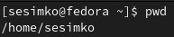

---
## Front matter
lang: ru-RU
title: Основы интерфейса командной строки Unix.
author:
  - Симко С.Е.
institute:
  - Российский университет дружбы народов, Москва, Россия
date: 4 марта 2023.

## i18n babel
babel-lang: russian
babel-otherlangs: english

## Formatting pdf
toc: false
toc-title: Содержание
slide_level: 2
aspectratio: 169
section-titles: true
theme: metropolis
header-includes:
 - \metroset{progressbar=frametitle,sectionpage=progressbar,numbering=fraction}
 - '\makeatletter'
 - '\beamer@ignorenonframefalse'
 - '\makeatother'
---

# Информация

## Докладчик

:::::::::::::: {.columns align=center}
::: {.column width="70%"}

  * Симко Сергей Евгеньевич
  * бакалавр
  * Российский университет дружбы народов
  * [1132222841@pfur.ru](mailto:1132222841@pfur.ru)

:::
::: {.column width="30%"}

:::
::::::::::::::

# Вводная часть

## Актуальность

- Умение пользоваться командной строкой крайне важно для пользователей Linux.

## Цели и задачи

- Научиться пользоваться командной строкой Linux.

## Команда pwd

- Print Working Directory - позволяет узнать **абсолютный** путь к директории, в которой запущена команда.
{#fig:001 width=70%}

## Команда ls

- Команда позволяет просмотреть содержимое текущей директории.
{#fig:002 width=70%}

## Команда mkdir

- С ее помощью можно создавать директории.
{#fig:003 width=70%}

## Команда rm

- Удаляет заданные файлы, а с флагом -r - директории.
{#fig:004 width=70%}

## Команда man

- Вызывает в терминал руководство по заданной команде.
{#fig:005 width=70%}

# Результаты

- Мы освоили самые базовые команды терминала Linux, необходимые любому пользователю.
