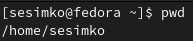
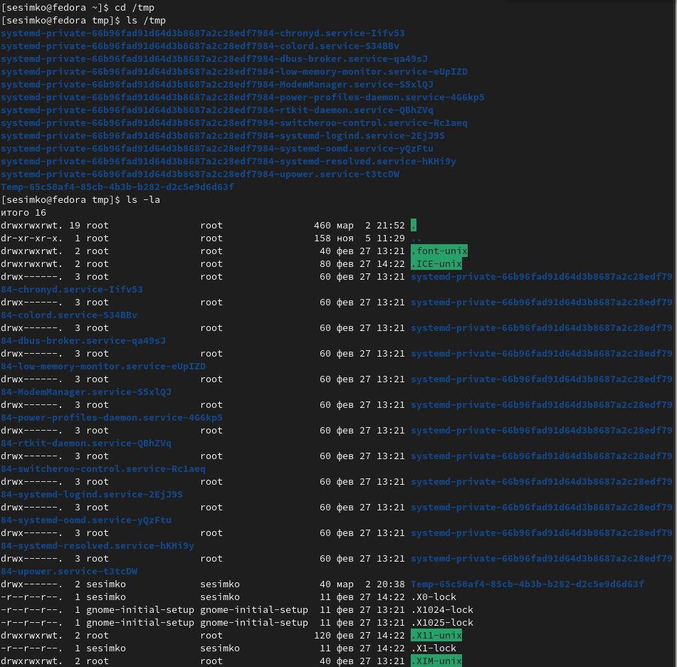
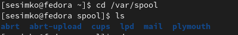
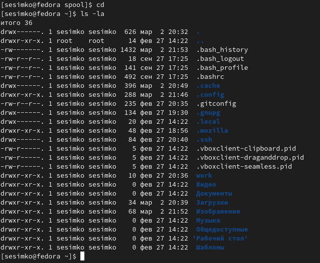
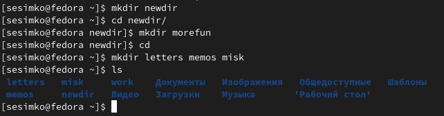
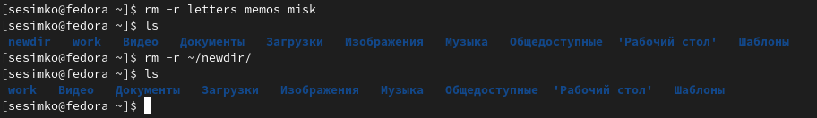
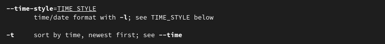
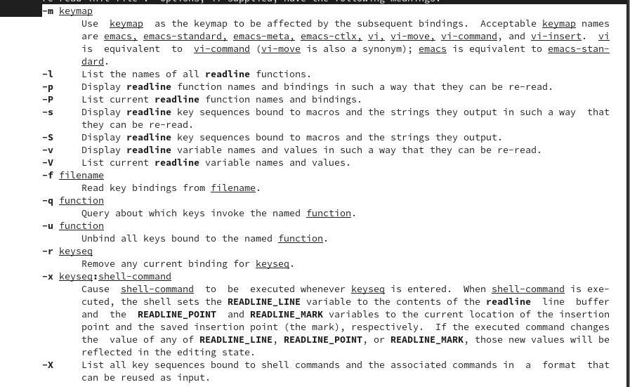
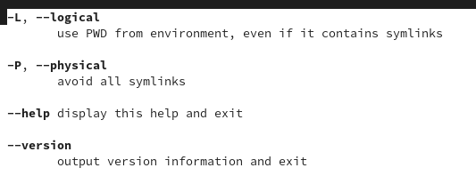
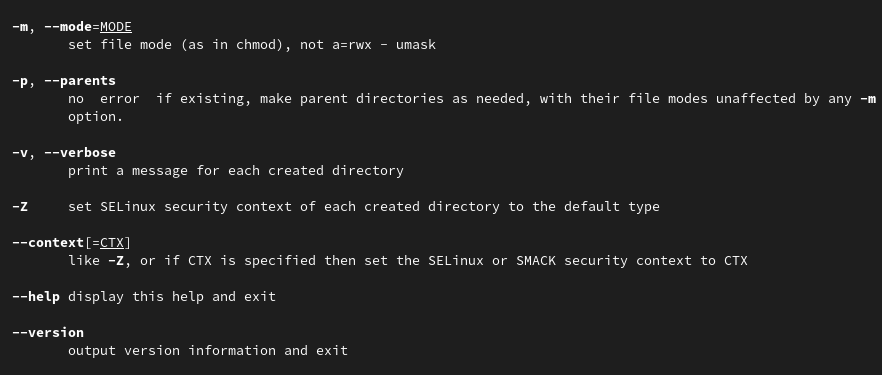

---
## Front matter
title: "Основы интерфейса взаимодействия пользователя с системой Unix на уровне командной строки."
subtitle: ""
author: "Симко Сергей Евгеньевич."

## Generic otions
lang: ru-RU
toc-title: "Содержание"

## Bibliography
bibliography: bib/cite.bib
csl: pandoc/csl/gost-r-7-0-5-2008-numeric.csl

## Pdf output format
toc: true # Table of contents
toc-depth: 2
lof: true # List of figures
lot: true # List of tables
fontsize: 12pt
linestretch: 1.5
papersize: a4
documentclass: scrreprt
## I18n polyglossia
polyglossia-lang:
  name: russian
  options:
	- spelling=modern
	- babelshorthands=true
polyglossia-otherlangs:
  name: english
## I18n babel
babel-lang: russian
babel-otherlangs: english
## Fonts
mainfont: PT Serif
romanfont: PT Serif
sansfont: PT Sans
monofont: PT Mono
mainfontoptions: Ligatures=TeX
romanfontoptions: Ligatures=TeX
sansfontoptions: Ligatures=TeX,Scale=MatchLowercase
monofontoptions: Scale=MatchLowercase,Scale=0.9
## Biblatex
biblatex: true
biblio-style: "gost-numeric"
biblatexoptions:
  - parentracker=true
  - backend=biber
  - hyperref=auto
  - language=auto
  - autolang=other*
  - citestyle=gost-numeric
## Pandoc-crossref LaTeX customization
figureTitle: "Рис."
tableTitle: "Таблица"
listingTitle: "Листинг"
lofTitle: "Список иллюстраций"
lotTitle: "Список таблиц"
lolTitle: "Листинги"
## Misc options
indent: true
header-includes:
  - \usepackage{indentfirst}
  - \usepackage{float} # keep figures where there are in the text
  - \floatplacement{figure}{H} # keep figures where there are in the text
---

# Цель работы

Приобретение практических навыков взаимодействия пользователя с системой посредством командной строки.

# Выполнение лабораторной работы

Определяем имя нашего домашнего каталога.
{#fig:001 width=70%}

Переходим в каталог /tmp и пробуем применить в нем ls с различными опциями.
{#fig:002 width=70%}

Ищем в каталоге /var/spool подкаталог cron, которого нет.
{#fig:004 width=70%}

Переходим в домашний каталог, выводим на экран его содержимое, чьим владельцем являюсь я.
{#fig:005 width=70%}

Создаем каталог newdir с подкаталогом morefun, затем каталоги letters, memos, misk в домашнем каталоге. 
{#fig:006 width=70%}

Удаляем созданные каталоги и проверяем.
{#fig:007 width=70%}

С помощью мануала узнаем, с помощью какого флага команды ls можно вывести содержимое подкаталогов. Это флаг -R.
{#fig:008 width=70%}

Теперь узнаем набор опций команды ls, позволяющий отсортировать по времени последнего изменения выводимый список содержимого каталога с развёрнутым описанием файлов. Это -t -l.
{#fig:010 width=70%}

Ознакомимся с мануалом команды cd,
{#fig:011 width=70%}

pwd,
{#fig:012 width=70%}

mkdir.
{#fig:013 width=70%}

# Контрольные вопросы.

1. Инструмент взаимодействия между человеком и компьютером путем отправки компьютеру команд. Команды интерпретируются интерпретатором, называемым оболочкой.
2. pwd (Print Working Directory)
3. ls -F. После директорий будет подписываться слэш, для исполняемых файлов звездочка, для обычных файлов ничего.
4. ls -la.
5. rm для файлов, для директорий нужно подписать флаг -r.
6. Команда history
7. С помощью стрелки вверх отмотать до нужной команды, во входной поток попадет команда, которую можно менять.
8. g++ main.cpp -o main && ./main 
Первая команда компилирует программу, вторая запускает ее.
&& означает, что если одна из команд в цепочке прервется, все следующие не будут выполнены.
Также есть вариант cmd1 ; cmd2 ; ... 
Команды будут последовательно выполнены в любом случае.
9. С помощью символа обратного слэша можно использовать специальные символы в терминале без их интерпретации командной строкой.
10. С флагом -l в терминал выводятся тип файла, права доступа, количество ссылок, имя владельца, имя группы, размер в байтах, временной штамп.
11. Абсолютный путь - путь к файлу от корневого каталога, относительный - от места поиска. Например, если в каталоге ~/a/b/c/ есть файл d, то абсолютный путь - ~/a/b/c/d, относительный относительно b - c/d.
12. Команда man, от слова manual.
13. tab

# Выводы

Мной были приобретены практические навыки взаимодействия с системой посредством командной строки.

