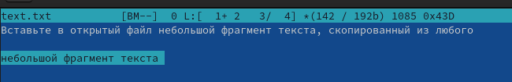

---
## Front matter
lang: ru-RU
title: midnight comander
subtitle: 
author:
  - Симко С.Е.
institute:
  - Российский университет дружбы народов, Москва, Россия
date: 01 января 1970

## i18n babel
babel-lang: russian
babel-otherlangs: english

## Formatting pdf
toc: false
toc-title: Содержание
slide_level: 2
aspectratio: 169
section-titles: true
theme: metropolis
header-includes:
 - \metroset{progressbar=frametitle,sectionpage=progressbar,numbering=fraction}
 - '\makeatletter'
 - '\beamer@ignorenonframefalse'
 - '\makeatother'
---

# Информация

## Докладчик

:::::::::::::: {.columns align=center}
::: {.column width="70%"}

  * Симко Сергей Евгеньевич
  * бакалавр
 
  * Российский университет дружбы народов

:::
::: {.column width="30%"}

:::
::::::::::::::

# Вводная часть

{#fig:001 width=70%}
:::
{#fig:002 width=70%}
:::
{#fig:003 width=70%}
:::
{#fig:004 width=70%}
:::
{#fig:005 width=70%}
:::
{#fig:006 width=70%}
:::
{#fig:007 width=70%}
:::
{#fig:008 width=70%}
:::
{#fig:009 width=70%}
:::
{#fig:010 width=70%}
:::
{#fig:011 width=70%}
:::
{#fig:012 width=70%}
:::
{#fig:013 width=70%}
:::
{#fig:014 width=70%}
:::
{#fig:015 width=70%}
:::
{#fig:016 width=70%}
:::
{#fig:017 width=70%}
:::
{#fig:018 width=70%}
:::
{#fig:019 width=70%}
:::
{#fig:020 width=70%}
:::
{#fig:021 width=70%}
:::
{#fig:022 width=70%}
:::
{#fig:023 width=70%}
:::
{#fig:024 width=70%}
:::
